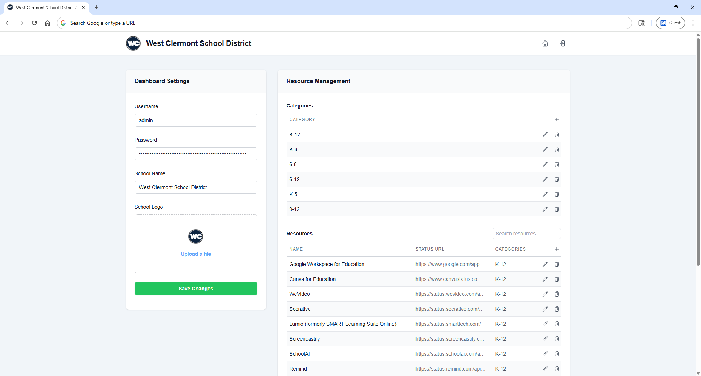
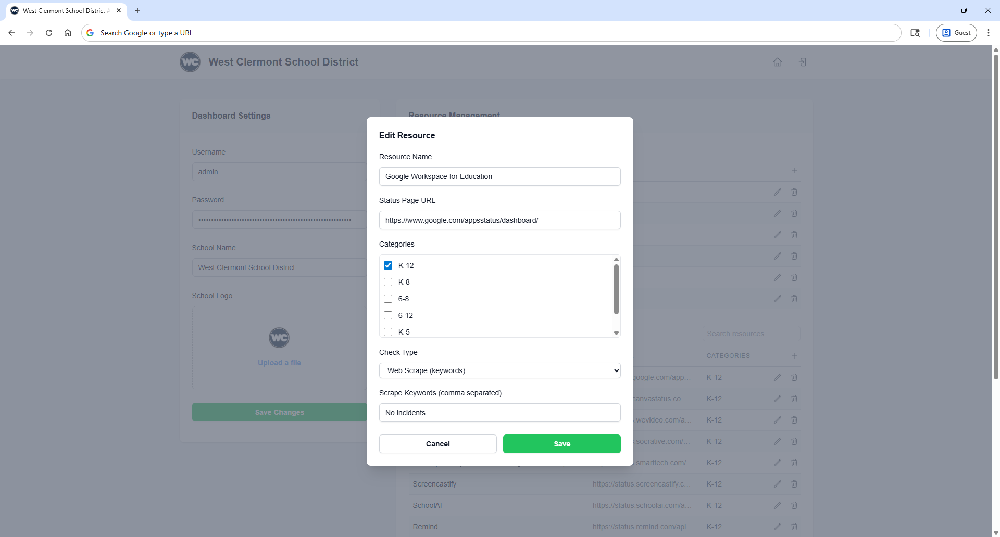

  <a href="#">
    
    <h1 align="center">Radar</h1>
  </a>

  <a aria-label="radar documentation" href="https://kevinmuscara.github.io/radar">Documentation</a> | 
  <a aria-label="radar documentation" href="#-screenshots">Screenshots</a> | 
  <a aria-label="radar documentation" href="#-key-capabilities">Features</a>

## Introduction
Radar is an open-source application designed for educational instituitions. It provides a unified interface to track the operational status of software services and digital resources including LMS, communication tools, authentication services, and other vital digital infrastructure. 

This repository includes the full Radar application, documentation, and various other supporting tools. 

### ⚡ Key Capabilities

- **Real-time Status Monitoring**: Automatically checks the status of configured services at regular intervals
- **Multiple Check Methods**: Supports API-based checks, web scraping, and simple heartbeat monitoring
- **Responsive Dashboard**: Clean, intuitive interface that works on desktop and mobile devices
- **Category Organization**: Group related services into logical categories for better organization
- **Status Indicators**: Color-coded status badges showing operational, degraded, maintenance, and outage states
- **Current Issues Section**: Highlighted section showing all services that are not fully operational
- **Search & Filter**: Quickly find services with built-in search functionality and category filters
- **RSS Feed**: Automated status feed for integration with other systems
- **Admin Panel**: Manage resources, categories, and monitoring settings
- **User Authentication**: Secure login system to protect administrative functions

## Talbe of contents
- [📚 Documentation](#-documentation)
- [👏 Contributing](#-contributing)
- [❓ FAQ](#-faq)
- [🏛️ License](#license)
- [📷 Screenshots](#screenshots)

## 📚 Documentation

Learn more about deploying Radar for your team <a aria-label="expo documentation" href="https://kevinmuscara.github.io/radar">in the official docs.</a>

## 👏 Contributing
If you like Radar and want to help make it better then check out the [Contributing Guide](./CONTRIBUTING.md)!

## ❓ FAQ
If you have any questions about Radar and want answers, then check out the [Frequently Asked Questions](/docs/faq.md)!

## 🏛️ License
The Radar source code is made available under the [MIT License](./LICENSE). Some of the dependencies used by Radar are licensed differently.

## 📷 Screenshots

