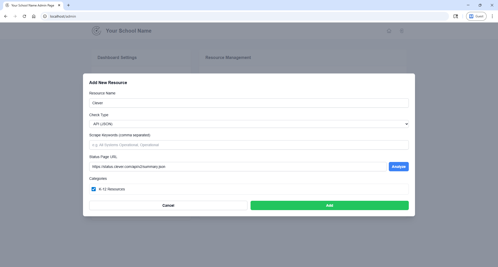
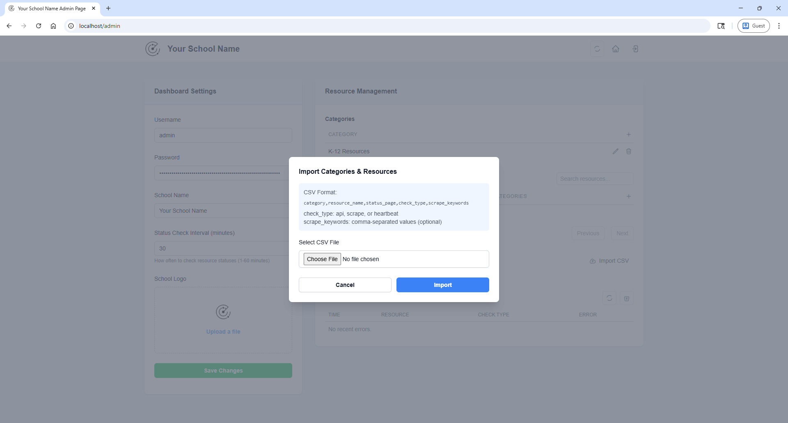
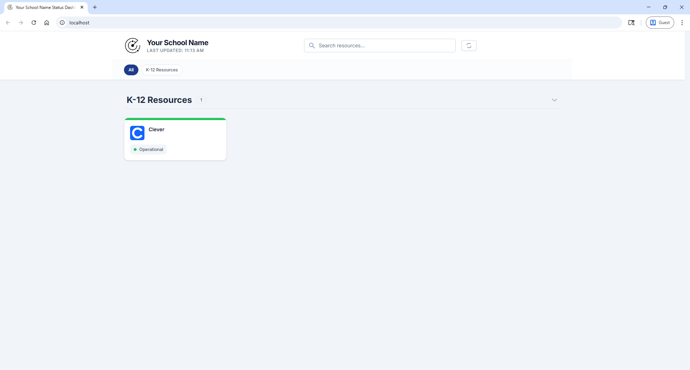

# Radar Usage Guide

## Setting up your Radar instance.

Once you have finished installing Radar on your server, you can begin setting up your dashboard by going to the host and port you have configured for your Radar environment. You will be presented with the setup wizard shown below. 

In this wizard, you can customize the following settings:
- Admin account username
- Admin account password
- Dashboard/School name
- Dashboard Branding/logo
- Status Check Interval

When you are finished customizing these settings, hit the blue `Complete Setup` button to continue. 

## Creating your first category

After you have completed the setup wizard, you will be brought to the admin dashboard. From here you can modify the settings you chose in the initial setup, such as changing the admin username/password, changing the branding logo, etc.

In the categories table to the right, click the `+` icon to create your first category. 

***NOTE: You must create a category first before you can create resources***

In the popup modal pictured below, enter the name for your category and click the green `Add` button.

You should now see your category listed in the table.

## Creating your first resource

After creating your first category, you can add your first resource. In the resources table just below the categories table, click the `+` icon to create your first resource.

In the popup modal pictured below, fill out the form. For more information about the types of checks, see the table below:

- **API (JSON)**: Use this if your resource link will be a JSON based status page.
- **Web Scrape (keywords)**: Use this if your resource will need to scrape a specific keyword off of the linked page. (Example: searching for the phrase "operational" on a page). 
- **Heartbeat (HTTP 200)**: Use this if your resource will simply have a heartbeat monitor of the linked page.

### API Scraping

Follow these steps to browse an API for a specific field for your resource status:

1. Type the API URL into the `Status Page URL` field on the add resource modal.
2. Select the blue `Analyze` button and the API Structure Explorer will show as pictured below:

3. You can use the search fields to search for a specific key or value in the structured API. Once you found the field for the object related to your reseource, select the field that contains the current status of the resource.

4. Once you have selected the associated field, you can now create the resource.

***NOTE: If using the Web Scrape (keywords) check type, be sure to include a keyword that you want to filter by.***

You will now see your category listed in the table. If you want to add a resource to more than one category, be sure to select multiple categories in the checkbox selection.

## Bulk importing categories

To bulk import multiple categories, you may begin by downloading the template csv file linked under the **Bulk Import** section. Once you have downloaded the template, add your resources following the header structure. If you need further assistance with adding resources, please refer to [This Guide](faq.md#how-can-i-bulk-import-my-resources)

Once you have completed your CSV import, you will see all of the categories and resources in their respective tables.

## The Status Dashboard

Once you have added all your resources, you can click the home button in the upper right corner, or goto the `/` route of your Radar instance to view the dashboard.

The dashboard automatically updates every 5 minutes with the latest status information from the server. Status checks are performed server-side at the interval you configured (default: 30 minutes).

## Server-Side Status Monitoring

Radar uses server-side status checking for optimal performance:

- **Automatic Checks**: Status checks run at your configured interval (1-60 minutes)
- **Instant Dashboard**: All users see cached results instantly
- **Auto-Refresh**: Dashboard updates every 5 minutes with latest cached data
- **Smart Retries**: Failed checks are automatically retried once
- **Error Logging**: Persistent failures are logged in the admin dashboard

### Adjusting Check Interval

To change how often resources are checked:

1. Navigate to Admin Dashboard
2. Go to Dashboard Settings
3. Adjust "Status Check Interval" (1-60 minutes)
4. Click "Save Changes"

The new interval takes effect immediately without restarting the server.

### Manual Refresh

Administrators can force an immediate status check:

1. Go to Admin Dashboard
2. Click "Refresh All Statuses" button in the header
3. Watch the progress bar to track completion

**Note**: Manual refresh is rate-limited to once per minute to prevent server overload.

### Monitoring Errors

Failed status checks are logged in the admin dashboard:

1. Go to Admin Dashboard
2. Scroll to "Status Check Errors" section
3. Review resources that failed both initial and retry attempts
4. Click "Clear Errors" to remove resolved issues

This helps identify resources with incorrect URLs or configuration issues.