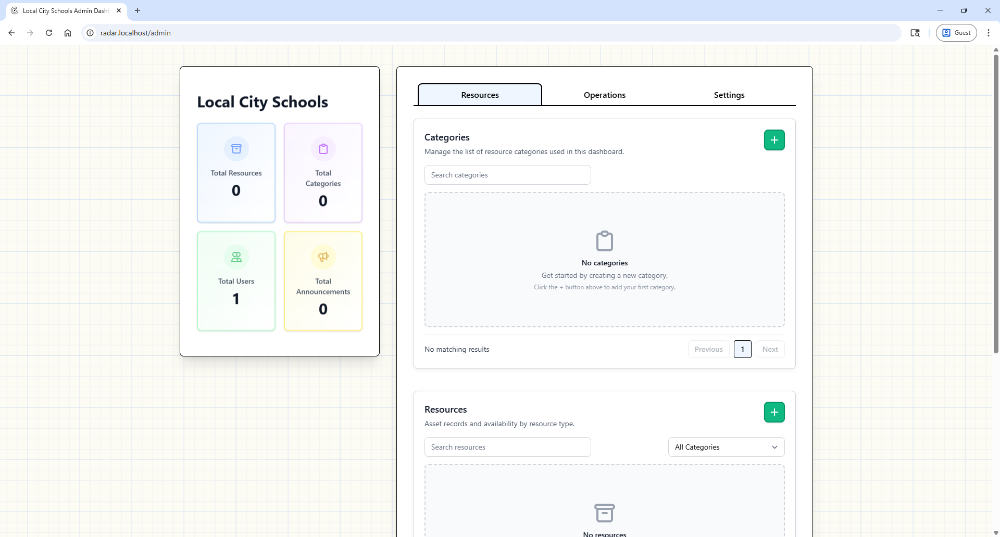
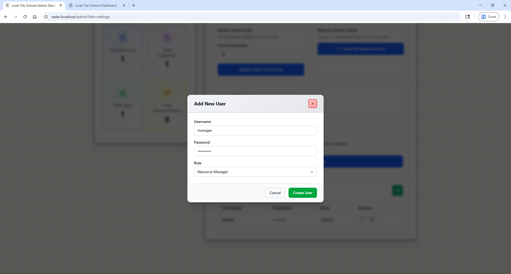
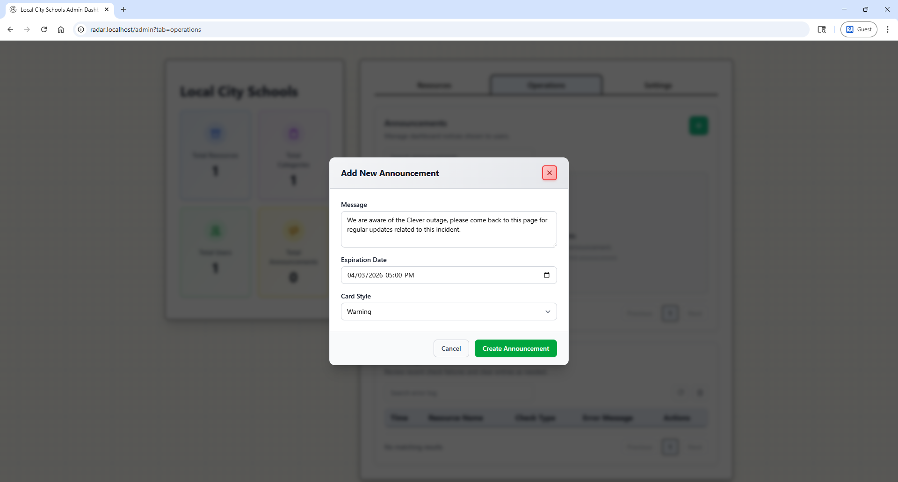
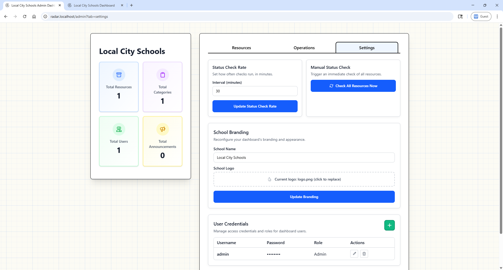

# Admin Guide

Super Admin includes all Resource Manager capabilities plus user and settings administration.

## What Super Admin Adds

- Manage users
- Manage system settings
- Force refresh status checks

## User Management

Create user accounts and assign roles.

Roles:

- **super_admin** - Another super admin user
- **resource_manager** - A limited admin user 

## Announcements Management

Create maintenance or incident announcements for all dashboard viewers.

## Settings

Configure:

- Logo and branding
- Refresh interval
- Admin-level settings

