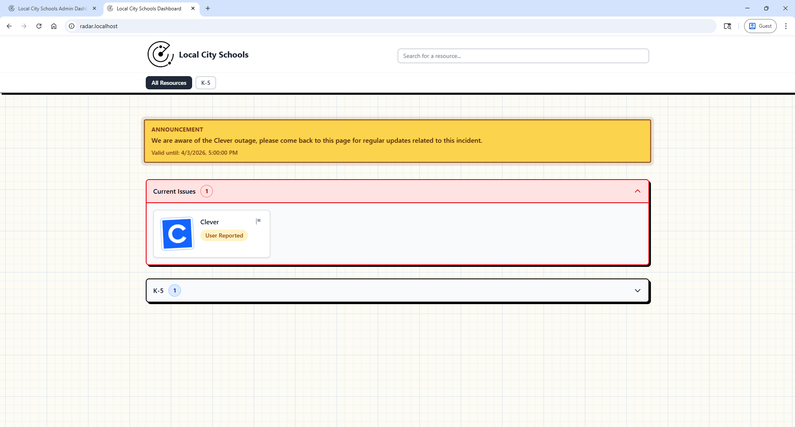

# Dashboard and Announcements

This page explains what users see on the main dashboard and how announcements appear.

## Dashboard View

The dashboard shows resources grouped by category with a current status label.

## Resource Cards

Each resource card includes the resource name and current status.

## Issue Reporting

Users can submit issue reports from the dashboard flow. Reports are tracked and will expire 1 hour after submission.

## Announcements

Announcements display prominently for planned maintenance and active incidents.

Best practices:

1. Use clear titles with impact and time window.
2. Set expiration so stale messages are removed automatically.
3. Update the same announcement as conditions change.