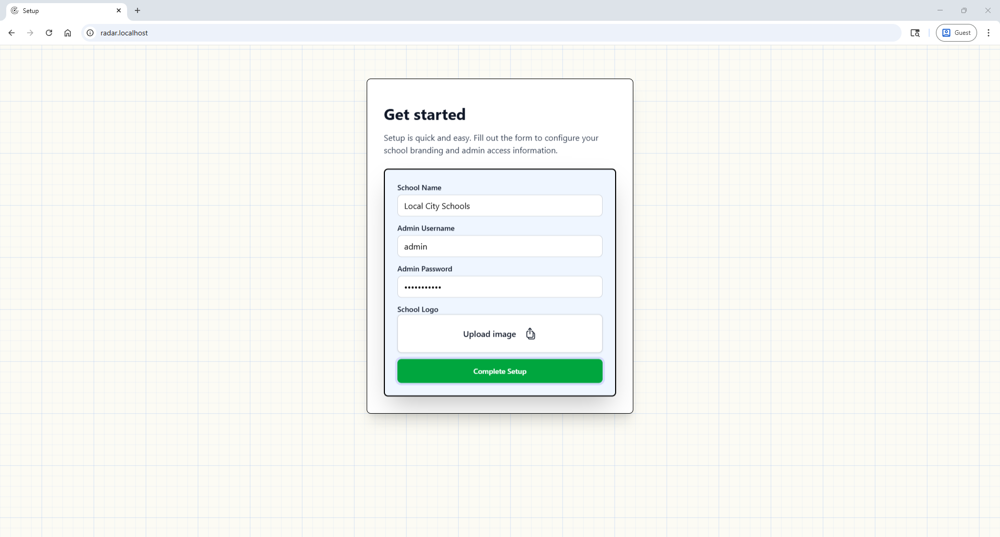
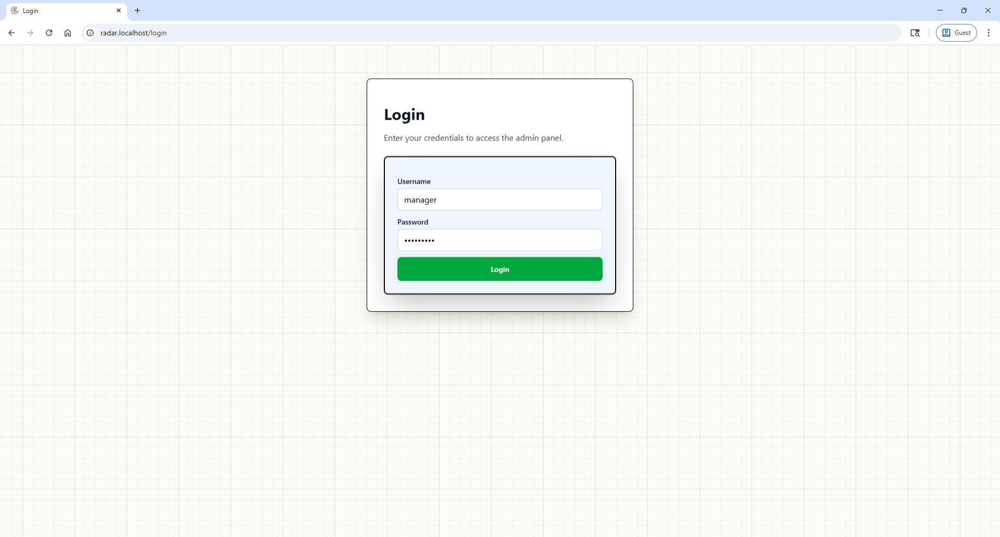

# Getting Started

This page covers first time setup of your radar instance.

## 1. Run Initial Setup

When Radar starts for the first time, complete the setup flow.

Steps:

1. Create your first admin account.
2. Set initial organization details.
3. Upload your branding logo if needed.
4. Complete setup.

## 2. Sign In

After setup, you may access the admin dashboard anytime using the login route `/login`

Once you've signed in, you can begin adding your digital resources and categories.

