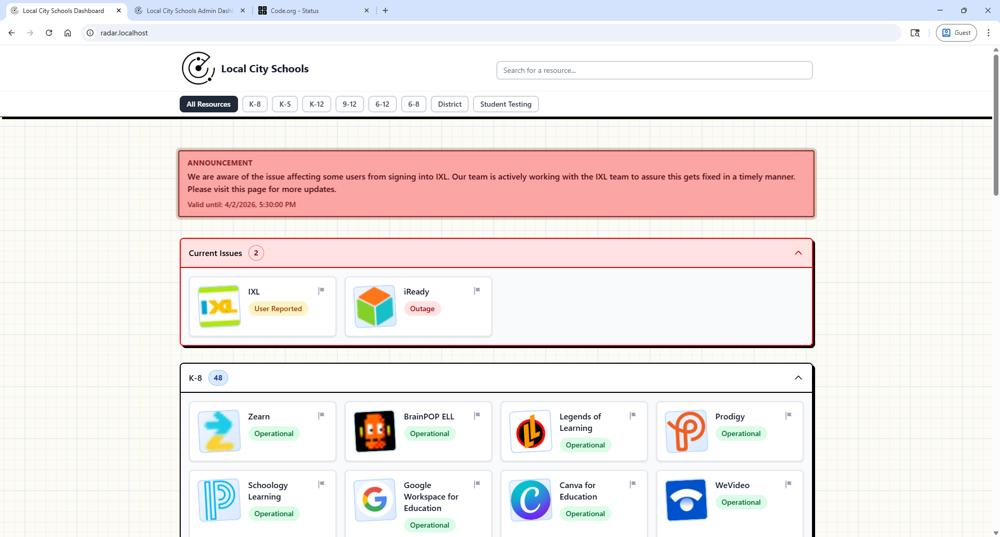

# Radar Wiki

Welcome to the Radar usage wiki.

Radar is a teacher friendly focused status dashboard for tracking the health of digital resources and infrastructure in one place.

## Start Here

1. [Getting Started](Getting-Started)
2. [Dashboard and Announcements](Dashboard-and-Announcements)
3. [Resource Manager Guide](Resource-Manager-Guide)
4. [Admin Guide](Admin-Guide)
5. [Operations and Troubleshooting](Operations-and-Troubleshooting)
6. [API and Integrations](API-and-Integrations)
