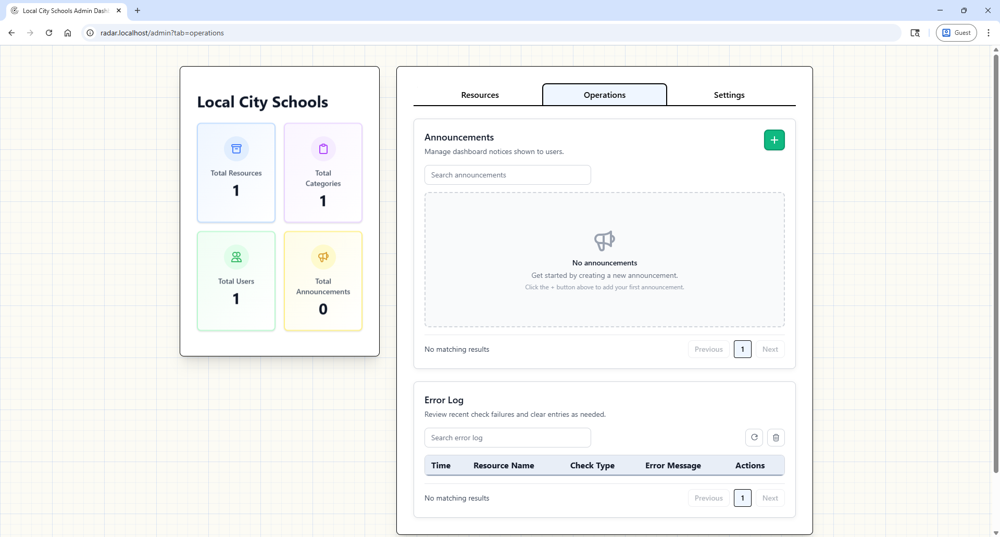
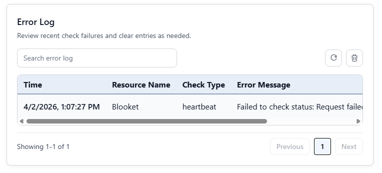

# Operations and Troubleshooting

Use this page for announcements and diagnosing status check problems.

## Operations View

The Operations page includes tools for managing system workflows and visibility.

## Error Log

Error Log records failed status checks and diagnostic context.

Guidance:

1. Start with most recent failures.
2. Verify target URL and network reachability.
3. Confirm check type matches endpoint behavior.
4. Correct resource config and re-test.

## Check Type Troubleshooting

### api

- Ensure endpoint returns valid JSON.
- Confirm field mapping path is correct.
- Use API Explorer to validate paths.

### scrape

- Confirm target page renders expected status text.
- Review scrape keywords for exact wording.

### heartbeat

- Success usually requires HTTP 200 response.
- Redirect or auth-only endpoints can fail.

### icmp

- Requires ping utility availability at OS level.
- May fail in restricted/containerized environments.

## Rate Limit Note

Force refresh is rate-limited to avoid abuse. If denied, wait and retry.
