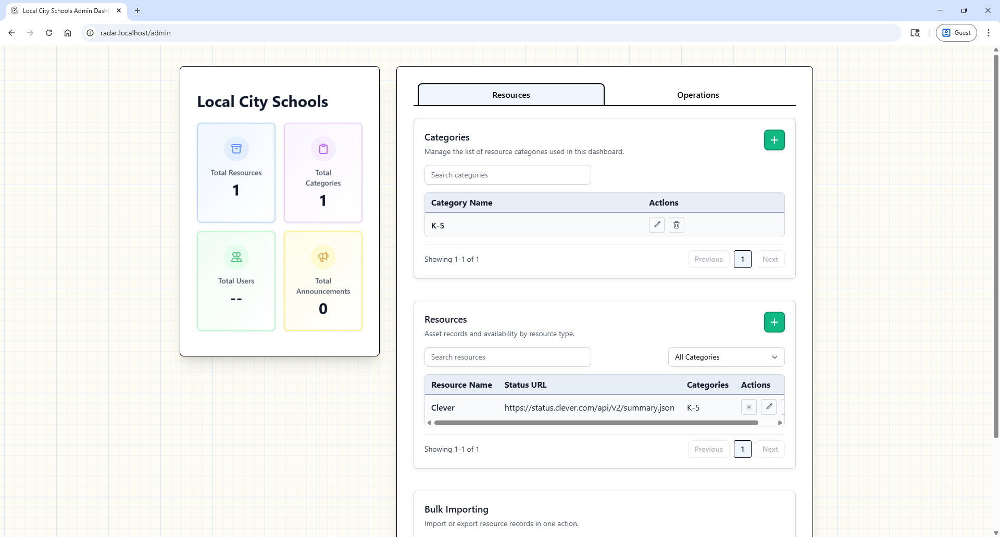
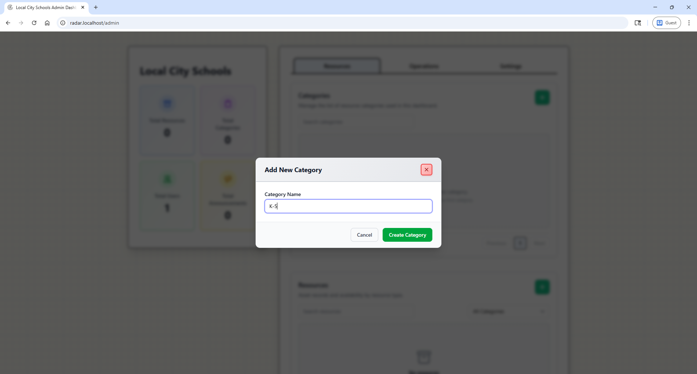
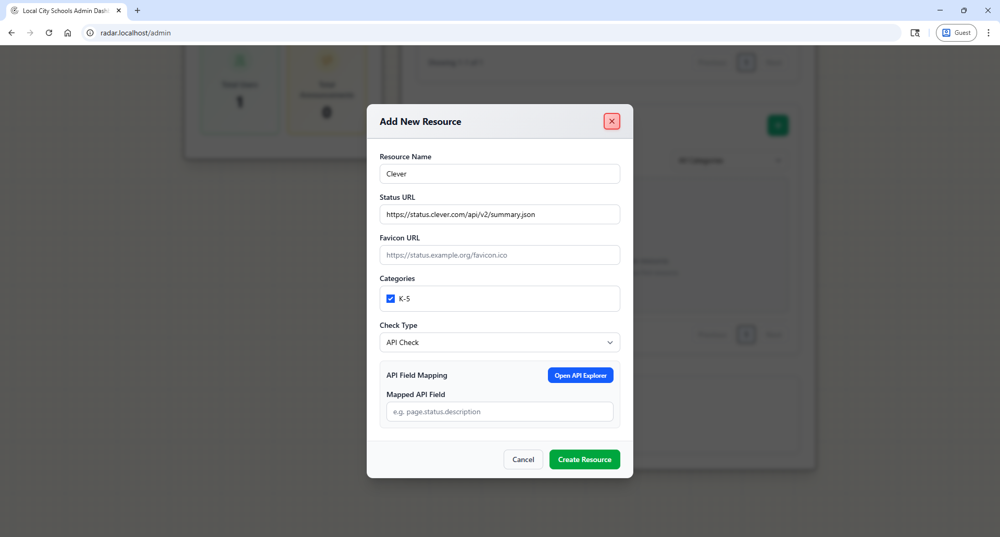
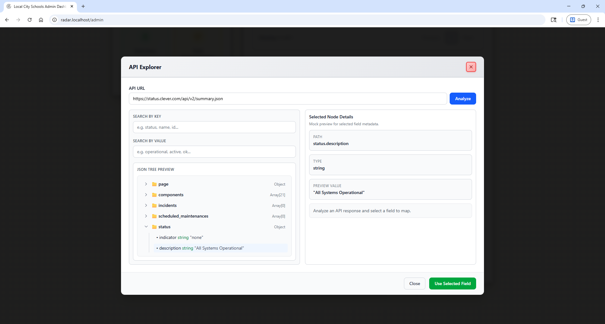
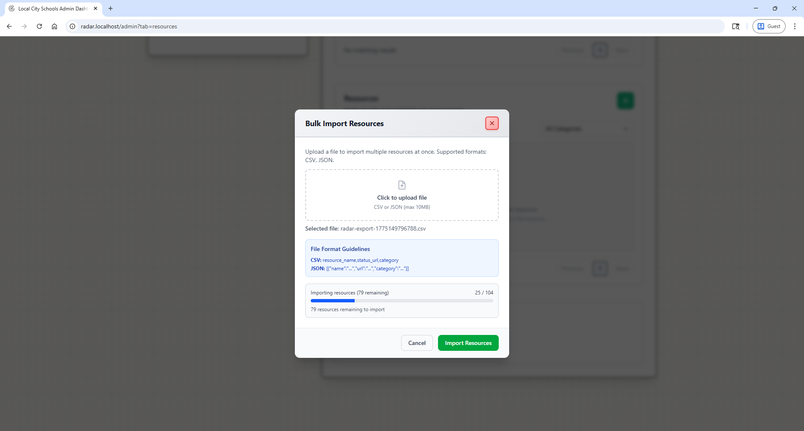

# Resource Manager Guide

## What Resource Managers Can Do

- View dashboard and statuses
- Add, edit, and delete categories
- Add, edit, and delete resources
- Run bulk import/export
- Create and manage announcements
- View error logs

## Category Management

Use category creation to organize resources by grade level, resource usage, or system type.

> **Deleting a category removes associated resources.**

## Resource Management

Add or edit resources with one of four check types:

- **api** scrape from a JSON URL endpoint
- **scrape** - web scrape text content from a URL
- **heartbeat** - simple 200 HTTP status check
- **icmp** - uses server `ping` utility to check IP or URL.

## API Explorer for Resource Checks

Use API Explorer to inspect JSON and choose the field path used for status extraction.

## Bulk Import and Export

Use bulk import for onboarding many resources quickly.

